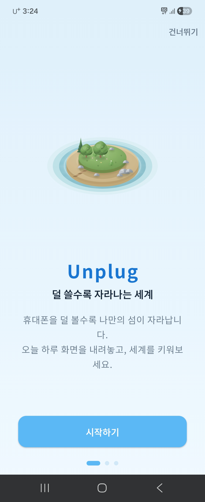
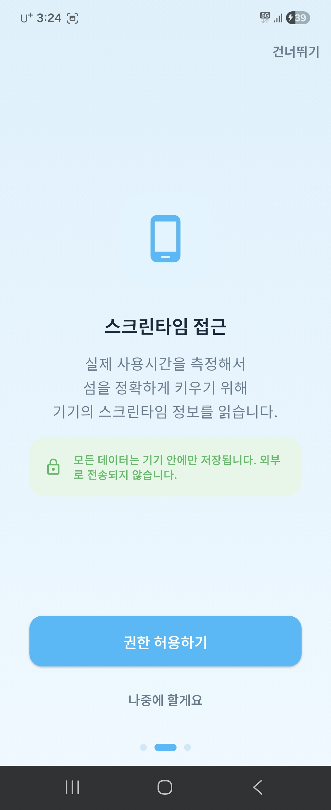
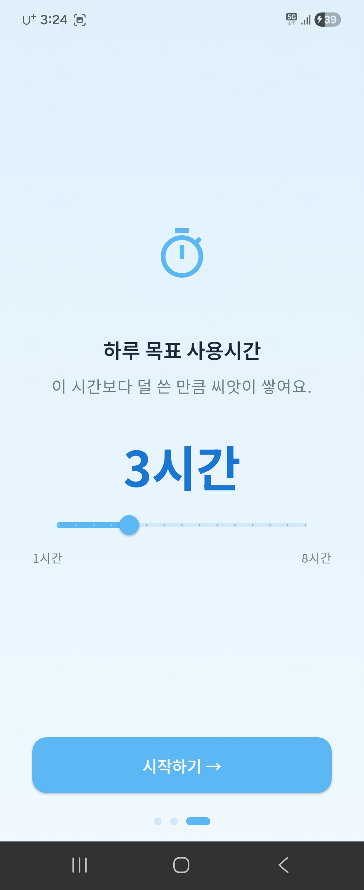
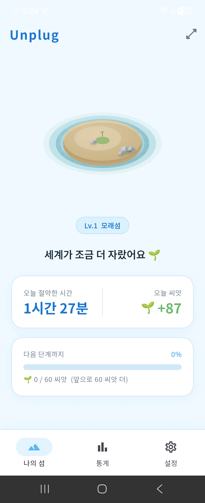
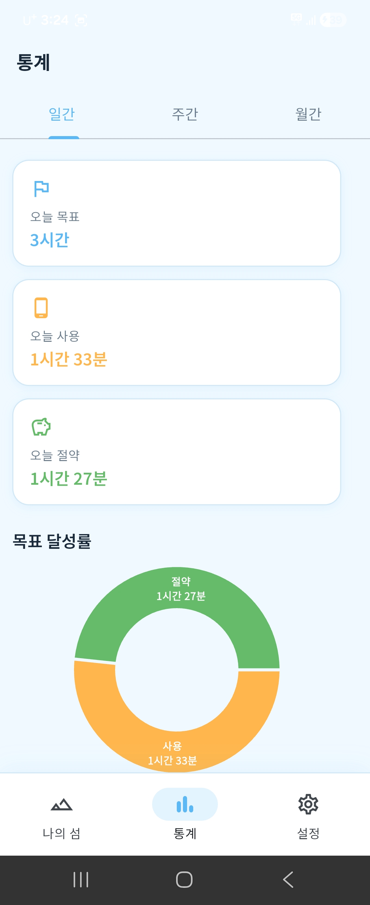
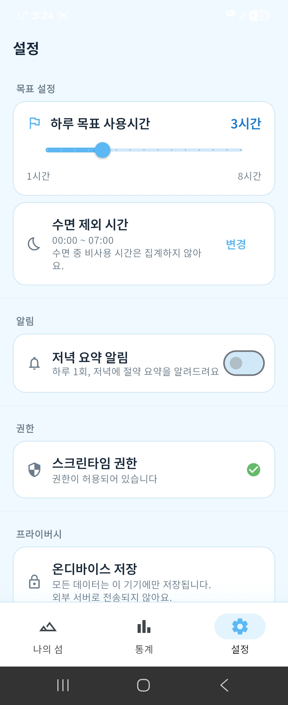

# Unplug (언플러그)

> **덜 쓸수록 자라나는 세계** — 휴대폰을 덜 볼수록 나만의 섬이 성장하는 디지털 웰빙 앱


---

## 실행 화면

<table>
  <tr>
    <td align="center"><b>온보딩 1</b></td>
    <td align="center"><b>온보딩 2</b></td>
    <td align="center"><b>온보딩 3</b></td>
  </tr>
  <tr>
    <td></td>
    <td></td>
    <td></td>
  </tr>
  <tr>
    <td align="center"><b>홈 (메인)</b></td>
    <td align="center"><b>통계</b></td>
    <td align="center"><b>설정</b></td>
  </tr>
  <tr>
    <td></td>
    <td></td>
    <td></td>
  </tr>
</table>

---

## 프로그램 개요

Unplug는 **스마트폰 사용 시간을 줄이는 것 자체가 보상이 되는** 역발상 디지털 웰빙 앱입니다.

기존 Forest·Opal 등의 앱이 특정 세션 동안만 화면을 막거나, 차단·강제 방식에 의존하는 것과 달리, Unplug는 하루 전체 스크린타임을 기준으로 **목표보다 덜 쓴 시간을 '씨앗(자원)'으로 환산**하고, 그 씨앗으로 나만의 섬이 단계적으로 성장합니다.

- 타이머 없이 **하루를 살기만 하면** 자동으로 측정
- 차단·강제가 아닌 **자율 + 긍정 보상** 방식
- 모든 데이터는 **기기 내에만 저장** (계정·로그인·서버 전송 없음)
- 많이 쓴 날은 성장이 멈출 뿐, **벌주지 않는** 톤 원칙

---

## 주요 기능

### 온보딩
- 앱 컨셉 3페이지 슬라이드 소개 (스킵 가능)
- 스크린타임 접근 권한 안내 및 요청
- 하루 목표 사용시간 슬라이더 설정 (1~8시간, 기본 3시간)
- 수면 시간 설정으로 야간 무한 적립 방지

### 홈 화면
- **섬 시각화**: 성장 단계(Lv.1 ~ Lv.12)에 따른 섬 이미지 + 부유 애니메이션
- 오늘 절약한 시간 및 획득 씨앗 실시간 표시
- 다음 단계까지 남은 씨앗 진행 게이지
- 당겨서 새로고침으로 최신 스크린타임 반영
- 권한 미획득 시 데모 모드 안내 배너

### 통계
- **일간**: 오늘 사용·비사용 시간 파이 차트 + 목표 달성 여부
- **주간**: 7일 막대 그래프 추이, 일별 씨앗 현황
- **월간**: 30일 캘린더 히트맵, 월간 인사이트 카드

### 세계 상세
- 섬 풀스크린 감상
- 단계별 성장 히스토리 타임라인
- 공유 카드 이미지 생성 (캡처 기반)

### 설정
- 목표 사용시간 조정 (슬라이더)
- 수면 시간 재설정 (TimePicker)
- 알림 켜기/끄기
- 권한 상태 확인 및 재요청
- 데이터 전체 초기화 (2단계 확인 다이얼로그)

---

## 기술 스택

| 분류 | 사용 기술 |
|---|---|
| 프레임워크 | Flutter 3.41.4 / Dart 3.11.1 |
| 상태 관리 | flutter_riverpod 2.6.1 (StateNotifier 패턴) |
| 로컬 DB | sqflite 2.3.x (4개 테이블, 온디바이스) |
| 라우팅 | go_router 14.x (StatefulShellRoute 3탭) |
| 차트 | fl_chart 0.69.x (막대·파이·히트맵) |
| 폰트 | google_fonts (Noto Sans KR) |
| 스플래시 | flutter_native_splash 2.4.x |
| 앱 아이콘 | flutter_launcher_icons 0.14.x |

### 아키텍처

```
lib/
├── core/             # 테마, 상수, 유틸리티
├── data/
│   ├── database/     # sqflite AppDatabase (싱글톤)
│   ├── models/       # 4개 데이터 모델
│   ├── repositories/ # settings / dailyRecord / world
│   └── services/     # ScreenTimeService (Mock → 실 구현 교체 예정)
└── presentation/
    ├── providers/    # Riverpod 상태 관리
    ├── onboarding/   # 온보딩 3페이지
    ├── home/         # 홈 + 섬 위젯
    ├── stats/        # 통계 탭
    ├── settings/     # 설정 탭
    └── world_detail/ # 세계 상세 및 공유
```

---

## 데이터 모델

| 테이블 | 설명 |
|---|---|
| Settings | 목표시간, 수면 윈도우, 알림, 온보딩 완료 여부 |
| DailyRecord | 날짜별 사용·비사용시간, 획득 자원 |
| WorldState | 현재 단계, 누적 자원, 마지막 성장일 |
| GrowthHistory | 단계 전환 이력 (언제 몇 단계로 올랐는지) |

### 비사용 시간 환산 로직

```
unusedMinutes  = max(0, targetUsageMinutes - usageMinutes)
resourceEarned = unusedMinutes × 1   // 1분 미사용 = 1씨앗
```

- 목표보다 적게 쓴 만큼만 씨앗 적립, 초과 사용 시 0 (음수 없음)
- 수면 시간을 제외하여 야간 무한 적립 방지
- 씨앗 누적 → 단계 임계값 초과 시 섬 자동 성장 (후퇴 없음)

---

## 본인 구현 범위

| 항목 | 내용 |
|---|---|
| 앱 기획 | 역방향 보상 메커니즘 고안, 타깃 페르소나 정의, 경쟁앱 분석 |
| 기능 명세 | 화면별 상세 명세, 데이터 모델 설계, 예외 케이스 정의 |
| 디자인 방향 | 스카이블루 팔레트, 톤 원칙(죄책감 금지·조용함), 화면 레이아웃 가이드 |
| 밸런싱 | 단계별 요구 씨앗 수치 조정 (Lv.1 즉시 ~ Lv.12 누적 약 4,700씨앗) |
| 단계 설정 | Lv.1 모래섬 ~ Lv.12 전설의 섬 단계명 및 이미지 방향 결정 |
| 에셋 기획 | 12단계 섬 이미지 스타일, 앱 아이콘, 스플래시 화면 시각 방향 |
| 세부 수정 | AI 생성 코드의 동작 오류 발견 시 수정 방향 지시 및 반영 |

---

## AI 활용 여부 및 활용 범위

이 프로젝트는 **바이브 코딩(Vibe Coding)** 방식으로 개발되었습니다.

### 코드 생성 (Claude Code)

기획안·기능명세서·디자인 가이드를 AI(Claude Code)에 전달하고, Flutter 앱 전체 코드를 AI가 생성하는 방식으로 개발했습니다.

- `lib/` 하위 소스 코드 전체 생성 (약 24개 파일)
- 컴파일 에러 디버깅 및 수정
- Riverpod StateNotifier 패턴, sqflite DB 설계, GoRouter 탭 구조
- fl_chart 통계 차트 (파이·막대·히트맵), 섬 부유 애니메이션 구현
- 앱 아이콘·스플래시 자동 생성 스크립트 적용

### 이미지 에셋 생성 (AI 이미지 생성 도구)

- **섬 단계 이미지** (`island_stage_01` ~ `island_stage_12`): AI 이미지 생성 도구로 제작
- **앱 아이콘** (`unplug_appicon.png`): AI 이미지 생성 도구로 제작
- **스플래시 화면** (`unplug_splash.png`): AI 이미지 생성 도구로 제작

---

## 개발 환경 설정

```bash
# 의존성 설치
flutter pub get

# 앱 아이콘 재생성 (필요 시)
dart run flutter_launcher_icons

# 스플래시 재생성 (필요 시)
dart run flutter_native_splash:create

# 디버그 APK 빌드
flutter build apk --debug

# 기기/에뮬레이터 실행
flutter run
```

**최소 요구사항**

- Flutter 3.41.4 이상
- Android SDK 21 (Android 5.0 Lollipop) 이상
- Dart 3.11.1 이상

---

## 향후 계획

- [ ] Android `UsageStatsManager` 실 연동 (현재 Mock 시뮬레이션 데이터)
- [ ] iOS `FamilyControls` 엔타이틀먼트 신청 및 연동
- [ ] 홈·잠금화면 위젯 (`home_widget` 패키지)
- [ ] 공유 카드 실제 공유 (`share_plus` 패키지)
- [ ] 로컬 알림 (`flutter_local_notifications`)
- [ ] 계절·날씨에 따른 섬 변화 연출 (v1.1)
- [ ] 친구/가족 비사용 리그 (v2, Firebase)

---

## 라이선스

MIT License

Copyright (c) 2026

Permission is hereby granted, free of charge, to any person obtaining a copy of this software and associated documentation files (the "Software"), to deal in the Software without restriction, including without limitation the rights to use, copy, modify, merge, publish, distribute, sublicense, and/or sell copies of the Software, and to permit persons to whom the Software is furnished to do so, subject to the following conditions:

The above copyright notice and this permission notice shall be included in all copies or substantial portions of the Software.

THE SOFTWARE IS PROVIDED "AS IS", WITHOUT WARRANTY OF ANY KIND, EXPRESS OR IMPLIED, INCLUDING BUT NOT LIMITED TO THE WARRANTIES OF MERCHANTABILITY, FITNESS FOR A PARTICULAR PURPOSE AND NONINFRINGEMENT. IN NO EVENT SHALL THE AUTHORS OR COPYRIGHT HOLDERS BE LIABLE FOR ANY CLAIM, DAMAGES OR OTHER LIABILITY, WHETHER IN AN ACTION OF CONTRACT, TORT OR OTHERWISE, ARISING FROM, OUT OF OR IN CONNECTION WITH THE SOFTWARE OR THE USE OR OTHER DEALINGS IN THE SOFTWARE.
